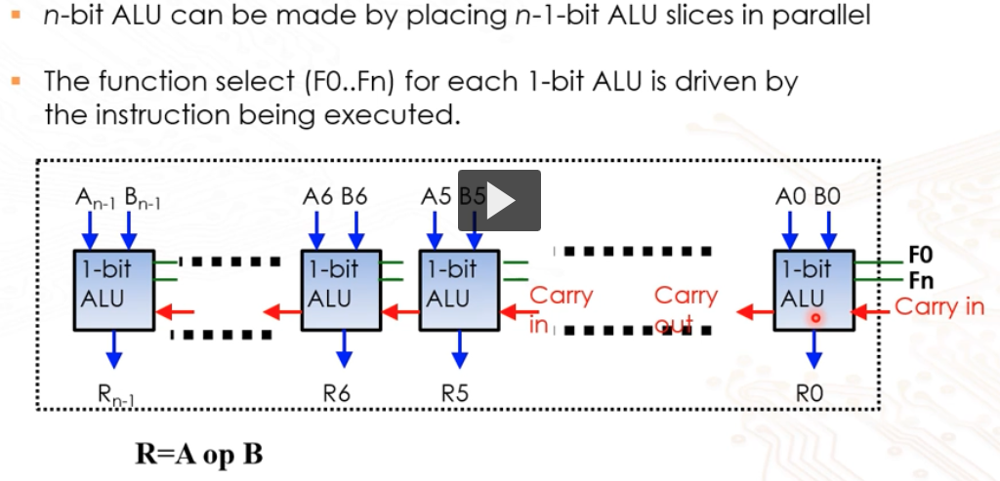
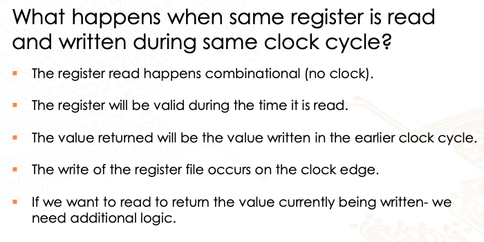
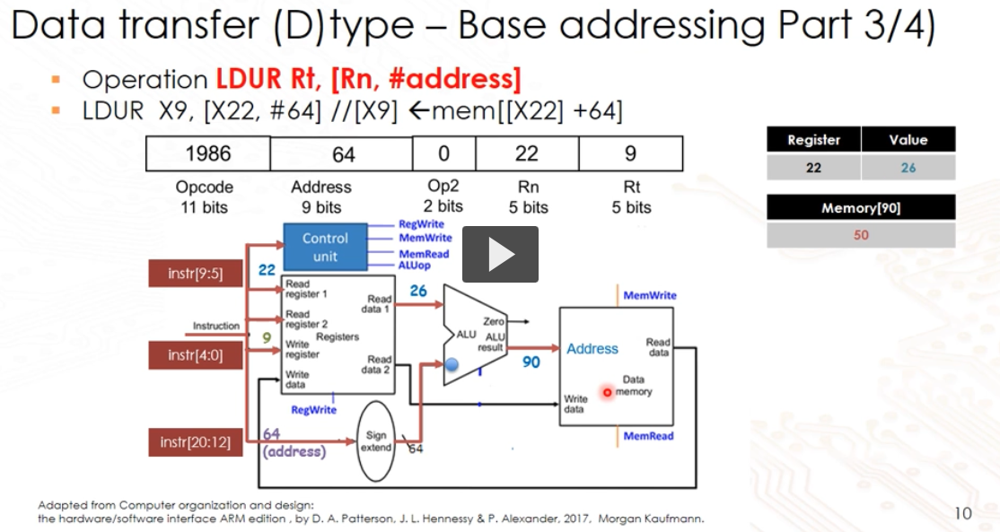

# Data path for ISA

## Multiplexer

When we use a 32:1 MUX, we will have a total of 32 possible entry lines. This means
we need 5-bits to represent the select line to map the input to output.

The select line is usually denoted by `CS`

## Decoder

We also use a 5:32 decoder. Our register is denoted in 5-bits, recall we have 32
registers. Thus, we have a 5-bit input to map to a 32-bit output. This is easy, 
since we have 5-bit, we can assign each combo to a register.

## Register file

Built using a flipflop. Flipflop has positive and negative edge trigger. We look
at the clock and on the trigger, we copy the input to the output.

## ALU datapath

- typically used for fixed-point operations
- more complex floating point operations done with co-processor

has a `function select` line, if we have $n$ function bits, we have $2^n$
different functions. This select is typically generated by a unit called
`ALU control` that takes the `ALUop` from the control unit and opcode instruction
to determine the function.

64 bit processing capability, thus be we need ...

### Sending data to ALU

From the instruction, we will get the registers that we want in the form of a 5-bit
address. We put this address in a MUX which will select the register needed and
the data will flow to the ALU.

### Writing data from ALU

1. ALU will process and input and output a value.
2. Now, we have a `write address` from the opcode in the instruction. This write
   address is passed through a 5:32 decoder to select the register file.
3. We also have a `RegWrite` line that determines
   if we want to enable writing of the ALU output.
4. If the `RegWrite` is enabled, the
   selected register will have the data written to it from the `data line` at the
   positive edge of the clock.

## Single cycle datapath

### R-type

### D-type

### Combined R,D type

Summary of datapath is similar to above, the key idea is each time we want to generalise
the execution we need to create another selection line to determine the input,
that is we need another MUX.

We should also be aware of how the instruction lifecycle fetch decode exec
ties in with the datapath

## Question to clarify

- this should be placing n 1-bit ALU slices. $[0, n-1]$ means there are n slices?

Response: no race condition, it is just forwarding of data. look in to the data
forwarding mechanism section for more information.

- this address should not be 64, but 64/4 = 16

Response: No, the multiplication of the addr is only done for branching instructions
and not for load or store.
