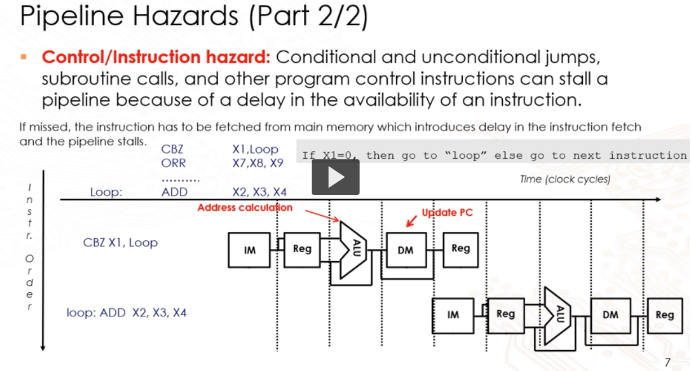

# Pipelining

## Clock cycle per instruction

$CPI = \text{Total CPU Cycles} / \text{Total Instructions Executed}$

We are concerned with the # of instructions here. Decomposing and instruction into
its blocks does not affect the # of instruction.

High CPI indicates that the CPU is inefficient, needs more cycles to finish given
instruction. Low CPI is great, but we must also take note of the lenght of each
cycle to be fair.

## Single cycle

### Shortening clock cycle

We can visualize the process as a single clock cycle for the entire lifecycle.
For example, if the lifecycle has 5 stages, then we can say that for 1 cycle
of a low and high signal, we complete 5 stages.

Whats the adv and disadv?

- low cycle per instructions but long clock period
- the entire cycle must wait for the slowest operation
- single bottleneck holds up the entire cycle

This can be further refined, that is, tag the clock cycle to each stage. But the
problems still remains, we need 5 clock cycles to finish 1 full task even those
cycles are shorter.

Whats the adv and disadv?

- we now get shorter clock period but we have a higher CPI.

## Ideal pipelining

We use a **reservation table** to show the pipeline stages and the execution of
the various resources that are used.

An ideal pipeline would not have any stalling (dependence of instructions).

Some factors that contribute to an ideal pipeline are

- identical task for all instructions
  - Which is not true, only load requires data mem while others don't
- Uniform decomposition of task
  - Pipeline stages complete in different time
- independent computations
  - execution of instruction may depend on preceding instructions

## Pipeline hazards

### Data hazard

When src or dest register of instruction is not avail in the pipeline stage.

- SUB and ADD where a variable is used in both instructions
- SUB X3,X2,X1 with ADD X4,X3,X2
- Write back happens at the last stage, so the decode stage of ADD must happen
  after that, this creates 3 stall cycles
- Note that decode will obtain the values needed for the exec, and that is why
  we stall from decode onwards

#### Solution

We can find dependencies of the instruction and remove them, the question is what
are the various types of dependencies?

- RAW
  - True dependency
  - One instruction relies on output of previous
- WAW
  - Output dependency
  - Shared write dest register
  - No problem since write back stage of current occurs after previous one is done
- WAR
  - Anti dependency
  - Previous instruction read, current is write
  - No issue since prev is at decode, current stage uses the same resource at write
    write back stage, so there is no contention

In summary, the RAW dependency is the only one that can impact and cause stalls
to the pipeline.

### Control hazard

Branch instructions that stalls due to availability of instruction

- in a CBZ instruction, the flag and new PC location is computed in the exec stage
- This means only compute is done in the ALU stage, and the PC is only updated
  after in the memory stage
- Any instruction which branches can only be fetched after the memory stage when
  the PC is updated

#### Solution

- Prediction of location to minimize stalling

### Structural hazard

Note that this hazard can occur independent of the other hazards

- when 2 instructions requires the same hardware resource
- Typical example is the LD, where it requires use of memory and there is an
  incoming instruction that requires the feteching of instruction
- This is usually seen in a Von-Neuman architecture where there is a single memory

#### Solution

- To handle this we stall the pipeline such that the fetch is in the next cycle
- Another way is to use a harvard architecture instead

## Question to clarify

- Pipeline hazard in control hazard, if there is no branch, then we don't need
  to stall the pipeline like what was shown in the LAMS video?
