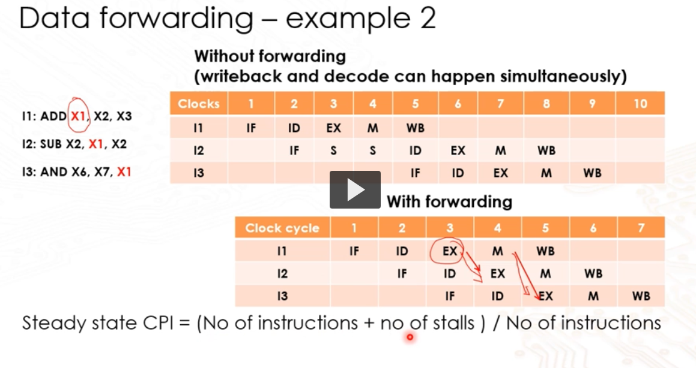
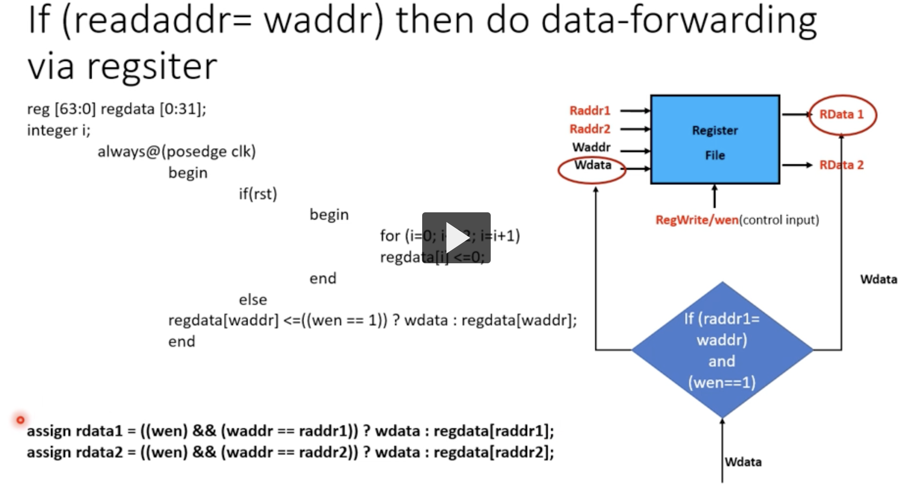

# Pipelining

## Pipeline hazards handling

Anti and output depdendency (WAW, WAR) are trival. RAW dependency are true dependence
on the value.

```assembly
SUB X3,X1,X2
AND X5,X3,X4
```

- Detect and wait
  - Stalling (hardware)
  - NOP (Software)
- Detect and forward
  - forward the data earlier
- Detect and eliminate
  - Software level
  - No hardware needed to detect
- Dynamic scheduling
- Instruction reordering
- Register renaming
- Loop unrolling
- Predict the needed value
- Multi-threading

### Detect and wait

X3 impacted with RAW dependency. We add 3 stall dependencies to place the decode
after the write back stage of the previous instruction.

We show an example below of a **hardware** stall. Note that all other instruction
after I2 cannot occur in parallel with the stall cycle! that is instructions only
start again after cycle 6.

| instr | 1   | 2   | 3     | 4     | 5     | 6   |
| ----- | --- | --- | ----- | ----- | ----- | --- |
| I1    | F   | D   | E     | M     | W     |     |
| I2    |     | F   | **S** | **S** | **S** | D   |

Below is an example of a **software** stall. We use NOP to skip a clock cycle.

| instr | 1   | 2   | 3   | 4   | 5   | 6   |
| ----- | --- | --- | --- | --- | --- | --- |
| I1    | F   | D   | E   | M   | W   |     |
| NOP   |     | -   | -   | -   | -   | -   |
| NOP   |     | -   | -   | -   | -   | -   |
| NOP   |     | -   | -   | -   | -   | -   |
| I2    |     |     |     |     | F   | D   |

### Detect and forward

To make use of the shared register to forward the data of the previous instruction
to the next. The register resource is used in the decode and write back stage,
simply we allow write and read in the same cycle.

The advantage is we only have 2 stall cycle rather than 3.

| instr | 1   | 2   | 3   | 4   | 5   | 6   |
| ----- | --- | --- | --- | --- | --- | --- |
| I1    | F   | D   | E   | M   | W   |     |
| I2    |     | S   | S   | F   | D   |     |

Data forwarding is also possible through the pipeline, that is we allow data to
forward to any stage. Since there are registers holding the data before each stage,
we can allow the register of previous instruction to retain the data over for the
next stage to utilize.

### Dynamic scheduling - out of order execution

in order execution

- instruction fetched, exec and completed based on compiler generated code
- one stall, all stall
- static schedule

Out of order instruction

- Similar to in order execution
- but with dynamic scheduling
- independent instructions can pass a stalled instruction

```assembly
LDUR X1,[X2,#100]
ADD X3,X1,X4 // X1 needed in exec stage
SUB X5,X6,X7
```

No matter how we try to solve this stall with data forwarding, we can only
start the execute after the mem stage for LDUR. This means we are always stuck
with one stall cycle. Out of order allows us to instead run the SUB instruction
first, that way there will not be a stall cycle.

### Instruction reordering

Similar to dynamic scheduling

### Register renaming

WAR and WAW dependency handling. This is important since we are reordering the
instruction. We can remove these dependencies to give us more instructions to
handle RAW dependencies.

Key idea: use another register in the next instruction so that these dependencies
are removed.

Keep in mind, more register resources will be used.

### Loop unrolling

Loop unroll allows us to reduce the number of times that we repeat a look. If
we unroll with a factor of 2, we are running the loop by 1/2 less.

By unrolling the loop and reordering, we gain the ability to fill possibly stalled
instruction with other instruction.

## Steady state CPI

$$CPI = \frac{#instruction + #stall}{#instruction}$$

## Read and write simultaneously

- Register read happens combinational (immediate without clock)
  - write is not, on clock edge and write enable

```c
//original
assign rdata1 = regdata[raddr1]
//modified
assign rdata1 = ((wen) && (waddr == raddr1)) ? wdata: regdata[raddr1]
```

what does this change mean? I_1 is writing while I_2 is reading. If we want to use
what was written in I_1 then in the new instruction code, we see that if write enabled
and if the write addr and read addr are the same, I_2 will take the written data
from I_1.

## Question to clarify



- Why do we not forward the information from I2 to I3 at the I2 exec stage? It is
  still from the previous clock cycle.
- what is difference between dynamic scheulding and instruction reordering



- Isn't there a trade off with data forwarding ? that is we have to suffer branch
  instruction
